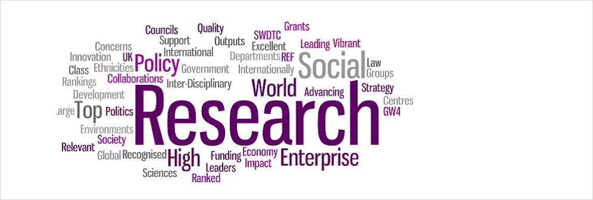
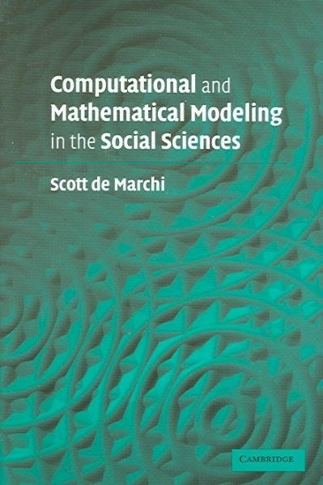

# Curso de pensamiento politico Latinoamericano

**Bienvenidos** :gift_heart:!

Semestre 1 | Curso 472/572 | Pensamiento politico
>
> Profesora: Smallville
>
>Salon: LINC 368 | Time: Tuesday/Thursday 9-9:50am

## **General rules**

El curso esta disenado para que xxxxxxxxxxxxxxxxxxxxxxxxxxxxxxxxxxxxxxxxxxxxxxxxxxxxxxxx

xxxxxxxxxxxxxxxxxxxxxxxxxxxxxxxxxxxxxxxxxxxxxxxxxxxxxxxxxxxxxxxxxxxxxxxxxxxxxxx

xxxxxxxxxxxxxxxxxxxxxxxxxxxxxxxxxxxxxxxxxxxxxxxxxxxxxxxxxxxxxxxxxxxxxxxxxxxxxxxx

------

## **Grades**

Habran dos examenes

## Contenido

[Semana 1 Lecturas](Week1/README.md)

Cities closer to ocean should be labeled over the ocean (left) while cities more inside continent should be labeled over land surface.

Semana 2.

....

Se crear una tabla tambien!!!! Animal

## Otros Resources 

Wallerstain idea [Articulo Mexicano sobre Wallerstain](http://www.scielo.org.mx/pdf/argu/v28n77/v28n77a7.pdf)

